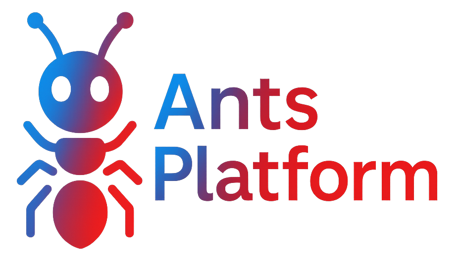

   

      <h3>
         <a href="https://cloud.ants-platform.com">
            <strong>ANTS Cloud</strong>
         </a> ·
         <a href="https://ants-platform.com/docs/deployment/self-host">
            <strong>Self Host</strong>
         </a> ·
         <a href="https://ants-platform.com/demo">
            <strong>Demo</strong>
         </a>
      </h3>
   

   

      <a href="https://ants-platform.com/docs"><strong>Docs</strong></a> ·
      <a href="https://ants-platform.com/issues"><strong>Report Bug</strong></a> ·
      <a href="https://ants-platform.com/ideas"><strong>Feature Request</strong></a> ·
      <a href="https://ants-platform.com/changelog"><strong>Changelog</strong></a> ·
      <a href="https://ants-platform.com/roadmap"><strong>Roadmap</strong></a> ·
   

    
   ANTS Platform uses <a href="https://github.com/orgs/ants-platform/discussions"><strong>Github Discussions</strong></a>  for Support and Feature Requests.
    
   <b>We're hiring.</b> <a href="https://ants-platform.com/careers"><strong>Join us</strong></a> in product engineering and technical go-to-market roles.
    
    
   

   

   
   
   
   
   
    
   
   
   
   
   
   

ANTS Platform is an **open source LLM engineering** platform. It helps teams collaboratively
**develop, monitor, evaluate,** and **debug** AI applications. ANTS Platform can be **self-hosted in minutes** and is **battle-tested**.

## Learn more

See the [ants-platform/ants-platform readme](https://github.com/ants-platform/ants-platform) and [docs](https://ants-platform.com/docs) for more details.
